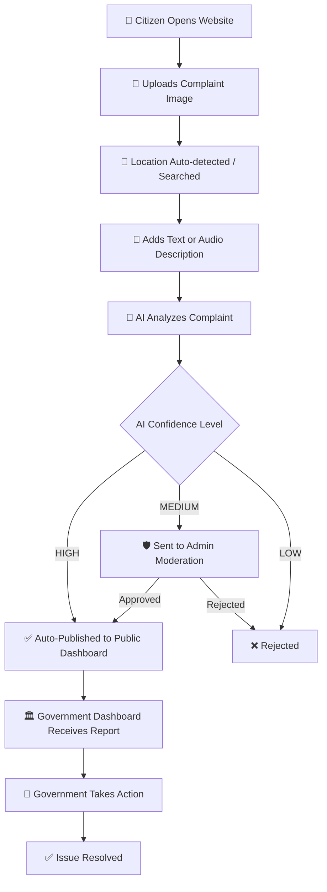

<p align="center">
  <h1 align="center">🎙️ AAWAJ — आवाज</h1>
  <p align="center">
    <strong>AI-Powered Smart Civic Complaint Reporting System</strong><br/>
    Built for Kathmandu Valley, Nepal 🇳🇵
  </p>
  <p align="center">
    <a href="#features">Features</a> •
    <a href="#tech-stack">Tech Stack</a> •
    <a href="#getting-started">Getting Started</a> •
    <a href="#architecture">Architecture</a> •
    <a href="#api-endpoints">API</a> •
    <a href="#contributing">Contributing</a>
  </p>
</p>

---

## 📖 About

**Aawaj (आवाज)** means *"Voice"* in Nepali.

AAWAJ is an AI-powered civic complaint platform that empowers citizens of Kathmandu Valley to report real-world public issues — from broken roads and garbage problems to water leakage and corruption — with just an image, a location, and a description.

The system uses **Google Gemini AI** to automatically analyze uploaded images, generate structured complaint descriptions, classify issues by category and urgency, and route verified reports through a moderation pipeline to government dashboards for resolution.

> *"AAWAJ is not just a website. It is a digital voice of the people."*

---

## ✨ Features

### 👤 Citizen Portal
- 📸 **Image-based reporting** — Upload photos of civic issues (mandatory)
- 📍 **GPS auto-location** — Automatic location detection on mobile devices
- 🗺️ **Smart location search** — Google Maps-style location autocomplete
- 🤖 **AI description generation** — Gemini AI analyzes images and auto-generates descriptions
- ✏️ **Editable AI text** — Review and modify AI-generated descriptions before submission
- 🔍 **Complaint tracking** — Track complaint status using a unique complaint code
- 📊 **Public dashboard** — Browse all verified public complaints

### 🤖 AI-Powered Intelligence
- 🏷️ **Auto-classification** — Categorizes issues (roads, water, electricity, garbage, etc.)
- 🔎 **Image verification** — Detects fake or irrelevant images
- 📝 **Description generation** — Generates structured reports from images
- ⚡ **Priority scoring** — Assigns urgency levels based on issue severity
- 🧠 **Confidence-based routing** — High confidence → auto-publish, Medium → admin review, Low → reject

### 🛡️ Admin Moderation
- 📋 Review pending complaints in a moderation queue
- ✅ Approve or ❌ reject complaints with notes
- 📜 Full moderation action logs

### 🏛️ Government Dashboard
- 📂 View all approved & verified complaints
- 🔧 Mark complaints as resolved with action details
- 🔍 Filter by area, category, and status
- 📥 Download structured reports

### 🗺️ Map & Heatmap
- 📌 Complaint location pins on interactive maps
- 🔥 Heat zones showing issue density
- 📊 Area-wise problem analysis

---

## 🛠️ Tech Stack

| Layer | Technology |
|-------|-----------|
| **Frontend** | HTML, CSS, JavaScript, Tailwind CSS |
| **Backend** | Django 5.x, Django REST Framework |
| **AI Engine** | Google Gemini AI (image analysis & text generation) |
| **Database** | SQLite (dev) — PostgreSQL (production) |
| **Auth** | Django built-in authentication with role-based access |
| **Maps** | Leaflet.js / OpenStreetMap |
| **Media** | Pillow (image processing), local media storage |
| **Environment** | python-dotenv for configuration management |

---

## 🚀 Getting Started

### Prerequisites

- Python 3.10+
- pip (Python package manager)
- Git

### Installation

**1. Clone the repository**
```bash
git clone https://github.com/your-username/aawaj.git
cd aawaj
```

**2. Create a virtual environment**
```bash
python -m venv venv

# Windows
venv\Scripts\activate

# macOS / Linux
source venv/bin/activate
```

**3. Install dependencies**
```bash
pip install -r requirements.txt
```

**4. Configure environment variables**

Create a `.env` file in the project root:
```env
SECRET_KEY=your-secret-key-here
DEBUG=True
GEMINI_API_KEY=your-gemini-api-key
```

> [!IMPORTANT]
> You need a valid [Google Gemini API key](https://aistudio.google.com/app/apikey) for the AI features to work.

**5. Run database migrations**
```bash
python manage.py migrate
```

**6. Create a superuser (admin)**
```bash
python manage.py createsuperuser
```

**7. Start the development server**
```bash
python manage.py runserver
```

Visit **http://127.0.0.1:8000/** in your browser.

---

## 🏗️ Architecture

```
AAWAJ/
├── aawaj/                  # Main Django project settings
│   ├── settings.py         # Project configuration
│   ├── urls.py             # Root URL routing
│   ├── wsgi.py             # WSGI entry point
│   └── asgi.py             # ASGI entry point
│
├── complaints/             # Core complaints app
│   ├── models.py           # Database models (Complaint, Images, Audio, etc.)
│   ├── views.py            # Views & API logic
│   ├── serializers.py      # DRF serializers
│   ├── urls.py             # App URL patterns
│   ├── admin.py            # Django admin configuration
│   ├── ai_service.py       # Gemini AI integration layer
│   └── management/         # Custom management commands
│
├── templates/              # HTML templates
│   ├── base.html           # Base layout
│   ├── home.html           # Landing page
│   ├── report.html         # Complaint submission form
│   ├── track.html          # Complaint tracking
│   ├── public_dashboard.html
│   ├── moderation.html     # Admin moderation queue
│   ├── government_dashboard.html
│   ├── government_case_detail.html
│   ├── map.html            # Interactive complaint map
│   ├── login.html
│   ├── about.html
│   └── contact.html
│
├── static/                 # Static assets
│   ├── css/                # Stylesheets
│   └── js/                 # JavaScript files
│
├── media/                  # User-uploaded files (images, audio)
├── manage.py               # Django CLI
├── requirements.txt        # Python dependencies
├── .env                    # Environment variables (not committed)
└── README.md               # This file
```

### System Flow



---

## 📡 API Endpoints

### Complaint Submission
| Method | Endpoint | Description |
|--------|----------|-------------|
| `POST` | `/api/complaints/submit/` | Submit a new complaint |
| `GET` | `/api/complaints/<id>/status/` | Check complaint status |
| `POST` | `/api/complaints/<id>/upload-images/` | Upload complaint images |
| `POST` | `/api/complaints/<id>/upload-audio/` | Upload audio evidence |
| `POST` | `/api/complaints/<id>/finalize/` | Finalize and process complaint |

### Public Data
| Method | Endpoint | Description |
|--------|----------|-------------|
| `GET` | `/api/complaints/public/` | List all public complaints |
| `GET` | `/api/dashboard/stats/` | Dashboard statistics |

### Moderation (Admin)
| Method | Endpoint | Description |
|--------|----------|-------------|
| `GET` | `/api/moderation/queue/` | Get moderation queue |
| `POST` | `/api/moderation/<id>/action/` | Approve / reject complaint |

### Government
| Method | Endpoint | Description |
|--------|----------|-------------|
| `GET` | `/api/government/complaints/` | View assigned complaints |
| `POST` | `/api/government/<id>/action/` | Mark resolution action |

---

## 🗄️ Database Models

| Model | Description |
|-------|-------------|
| **User** | Extended Django user with roles (`citizen`, `admin`, `moderator`, `government`) |
| **Complaint** | Core complaint record with description, location, category, status, AI verdict |
| **ComplaintImage** | Images attached to a complaint |
| **ComplaintAudio** | Audio recordings attached to a complaint |
| **ModerationLog** | Admin actions log (approve/reject with notes) |

---

## 👥 User Roles

| Role | Access |
|------|--------|
| **Citizen** | Submit complaints, track status, view public dashboard |
| **Admin / Moderator** | Review & moderate complaints, manage moderation queue |
| **Government** | View verified complaints, take action, mark resolved |

---

## 🔮 Future Roadmap

- [ ] 🇳🇵 Nepali language (नेपाली) support
- [ ] 📱 Mobile app (React Native / Flutter)
- [ ] 📩 SMS-based complaint submission
- [ ] 💬 WhatsApp bot integration
- [ ] 🔥 Live real-time complaint heatmap
- [ ] 🏢 Auto-routing to specific government departments
- [ ] 🔁 Duplicate complaint detection
- [ ] 🔔 Real-time push notifications
- [ ] ☁️ Cloud deployment (AWS / Render / Railway)
- [ ] 🗄️ PostgreSQL + Redis for production scaling

---

## 🤝 Contributing

Contributions are welcome! Here's how to get started:

1. **Fork** the repository
2. **Create** a feature branch (`git checkout -b feature/amazing-feature`)
3. **Commit** your changes (`git commit -m 'Add amazing feature'`)
4. **Push** to the branch (`git push origin feature/amazing-feature`)
5. **Open** a Pull Request

---

## 📄 License

This project is developed as part of an academic / civic initiative for Kathmandu Valley, Nepal.

---

<p align="center">
  <strong>🇳🇵 Built for Kathmandu. Powered by People. Driven by Technology.</strong><br/>
  <em>AAWAJ — Giving every citizen a voice.</em>
</p>
